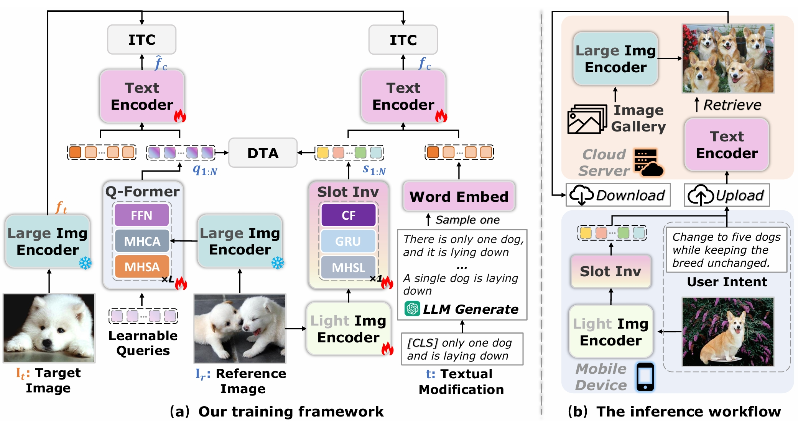

# Slot4ACir
Official implementation of the ICME 2025 paper "Slot Inversion for Asymmetric Composed Image Retrieval"[Paper](https://www.computer.org/csdl/proceedings-article/icme/2025/11209393/2beCcT9a6Hu)

## Highlights
We propose a novel framework, Slot Inversion for Asymmetric Composed Image Retrieval (Slot4ACir), which adopts an asymmetric setting: lightweight models are employed on the query side, while large vision-language models are deployed on the gallery side. In this framework, we propose a lightweight inversion module based on slot attention, which maps an image into multiple textual tokens with distinct semantics. Additionally, the LLM sampler and the distillation alignment (DTA) loss are introduced to facilitate richer semantic interactions and the extraction of more informative representations, respectively.



## Usage
### Requirements
We use a single NVIDIA 4090/A100 GPU for training and evaluation.
```
conda create -n slot4acir -y python=3.9
conda activate slot4acir
pip install torch==2.0.1 torchvision==0.15.2 torchaudio==2.0.2
pip install -r requirements.txt
```
### Prepare Datasets
We have uploaded all datasets used to [Google Drive](), which includes the original CIRR and FashionIQ dataset, as well as additional text data generated by the LLM sampler.
